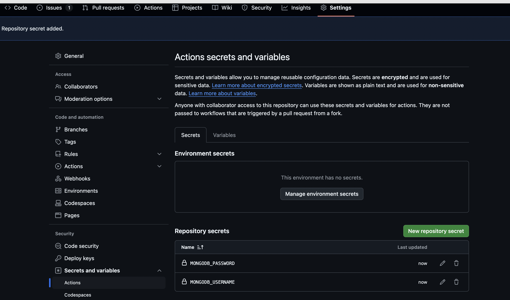

# GitHub Actions - The Complete Guide

Following the above course on Udemy, and recording my learning here

## First Workflow
The workflow will consist of a .yml file, which has some keywords, like *name*, *on* (specifying the trigger event), as well as *jobs* (specifying the work that should be done).

```yml
name: First Workflow
on: workflow_dispatch
jobs:
  first-job:
    runs-on: ubuntu-latest
    steps:
      - name: Print greeting
        run: echo "Hello World!"
      - name: Print goodbye
        run: echo "Bye bye ;)"
```

The *on: workflow_dispatch* means that the workflow will be executed manually by the user, and not on some other events.

The jobs consist of a list of jobs, in which we give each job an identifier of our choice (ex: first-job).

Then, we will use the *runs-on* keyword to specify what type of machine will be used.
\\
Then we will specify the steps.

**Result:**


## Second Workflow (Running tests for React app)

We have simple unit tests for this React application, in which in a real scenario, we would want to run this using a workflow.

```yml
name: Test Project
on: push
jobs:
  test:
    runs-on: ubuntu-latest
    steps:
      - name: Get code
        uses: actions/checkout@v3
      - name: Install NodeJS
        uses: actions/setup-node@v3
        with:
          node-version: 18
      - name: Install dependecies
        run: npm ci
      - name: Run tests
        run: npm test
```

For the above *on* keyword, we have various triggers such as repository-related (push, pull_request, and so on), or dispatch events.
\\
We are then getting the code from the repo, installing NodeJS, installing dependencies, and then executing the `npm test` command.

We can have **multiple jobs** in the same workflow, as shown in *deployment.yml*.

By default, jobs run in parallel, but if we want them to run sequentially, we have to add the **needs** keyword.

We can see the sequential execution visually:


## Skipping Workflows
This can be done by adding specific keywords to your commit message.

For example, a commit message can look like this: `added comments [skip ci]`.

This commit message will cause no new workflows to be started.

## Job Artifacts
Job artifacts are output assets (ex: app binary, website files, etc.) which are produced by the job.
These assets can be downloaded and used manually using GitHub UI or REST API, or be downloaded and used in other jobs **using Actions**.

For example, in our practice-react-app, when we run `npm run build`, we get files in the `dist` folder.

We can use these files that are generated here further to do other tasks, such as upload them on a server where we are hosting the website.

We do that by adding an **Upload Artifacts** step like so:

```yml
- name: Upload artifacts
  uses: actions/upload-artifact@v3
  with:
    name: dist-files
    path: ./practice-react-app/dist
```

The same way we are uploading, we can also download artifacts

```yml
- name: Get build artifacts
  uses: actions/download-artifact@v3
  with:
    name: dist-files
- name: Output contents
  run: ls
```

We want to **cache dependencies** since we do not want to download them for every job.

If dependencies are cached in one job, they can be used in other jobs and workflows.
But we need to specify the same piece of code in all our jobs.

```yml
- name: Cache dependencies
  uses: actions/cache@v3
  with:
    path: ~/.npm
    key: deps-node-modules-${{hashFiles('**/package-lock.json')}}
```

It is taking much less time now to download the dependencies in other jobs, since it is using the cached dependencies from the first-ran job.

Since we are using the package lock json file as part of the cache key, if we use `npm update` to update our dependencies, it will no longer use those cached dependencies since they are now outdated.

## Environment Variables

We want to provide environment variables inside our workflow itself, so as to simulate different variables based on the environment (testing or production).

The way we do that is by adding an `env` keyword in the workflow file, where we can add it on a whole workflow level (shared between all jobs), or we can add it on a job level as well.

Ideally, we do not want to hard-code our values inside the workflow files, and there is a better way (much like Hashicorp Vault).

We add secrets from the repository settings, under Security --> Secrets --> Actions:


Then, we remove the hard-coding of the values, and instead use the secrets context object:

```yml
env:
  MONGODB_USERNAME: ${{ secrets.MONGODB_USERNAME }}
  MONGODB_PASSWORD: ${{ secrets.MONGODB_PASSWORD }}
```

### Adding Environments in GitHub
We can have different values for our environment variables in GitHub (ex: DEV, QA, PROD), and therefore, we can create these environments from the repository settings.

After I create an environment (I created one called DEV), I can create my own environment variables inside that environment, and then I must specify that environment in the workflow.

```yml
jobs:
  test:
    environment: testing
```

There are many features for specific environments, for example like QA or PROD, we would want specific reviewers/approvers or some other condition.

## Controlling Workflow & Job Execution

What if one step fails, and we would still want to execute the next step? Or if we want steps to be executed conditionally, etc.

We have one step in our new workflow in `execution-flow.yml` where we upload a test report. We can add a conditional for this to make sure this is only executed only if the `npm run test` fails.

We give an `id` to the previous step, and then reference it using the `steps.id.outcome` like so:

```yml
- name: Run tests
  id: run-tests
  run: npm test
  working-directory: ./practice-react-app
- name: Upload test report
  if: failure() && steps.run-tests.outcome == 'failure'
  uses: actions/upload-artifact@v3
  with:
    name: test-report
    path: test.json
```

We also need to add the `failure()` function before checking the outcome of the step because GitHub Actions has the default behavior of not executing any other steps after the code.

We can run a separate job when any of our jobs fail, and we can do that by just specifying `failure()` in the `if` field like so:

```yml
report:
  if: failure()
  runs-on: ubuntu-latest
  steps:
      - name: Output information
        run: |
          echo "Something went wrong"
          echo "${{ github.event_name }}"
```
